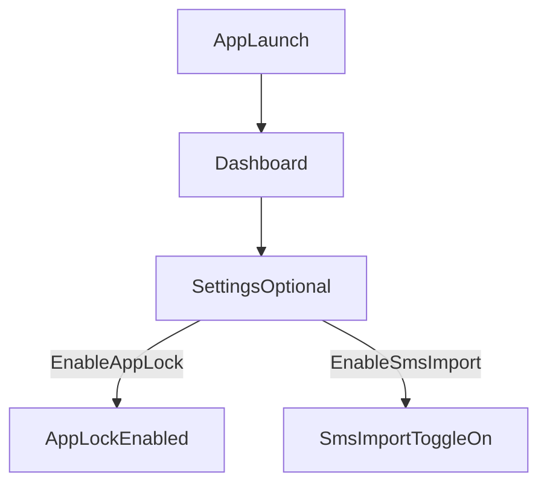
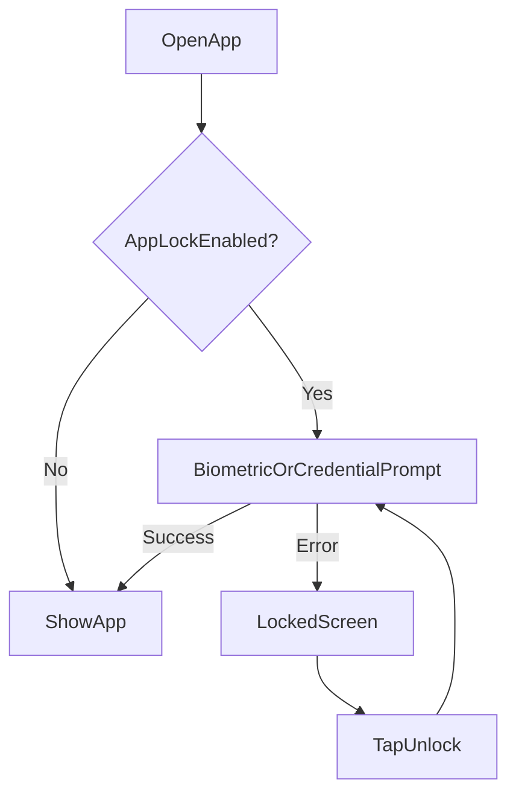
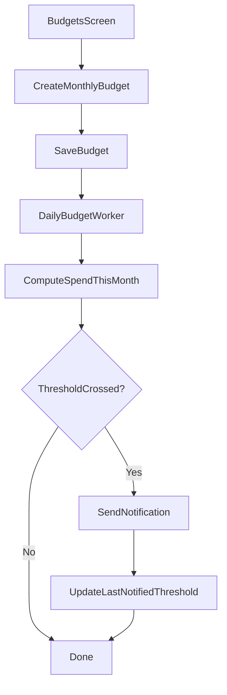

# UX Flows — Phase 1

## Onboarding (first run)
- App launches to Dashboard.
- Seed default categories automatically.
- User can optionally enable:
  - App Lock
  - SMS Import



## App lock (local authentication)
- If app lock is enabled, show lock gate.
- User authenticates via biometric or device credential.
- On success, show main UI.



## Manual add transaction
- User goes to Transactions tab.
- Taps +.
- Enters amount + optional merchant/notes + type.
- Saves → transaction appears in list and affects Dashboard totals.

```mermaid
flowchart TD
  txTab[TransactionsTab] --> fab[TapPlus]
  fab --> form[AddTransactionForm]
  form -->|Save| persist[InsertTransaction(MANUAL)]
  persist --> list[TransactionsListUpdated]
  persist --> dash[DashboardUpdated]
```

## SMS import (Phase 1)
- User enables SMS import in Settings.
- On “Import SMS now”:\n  - If permission missing → request `READ_SMS`.\n  - If granted → parse + import new transactions.\n  - Duplicates are ignored via `sourceKey` unique index.

```mermaid
flowchart TD
  settings[Settings] --> toggle[SmsImportEnabled]
  toggle --> importBtn[TapImportSmsNow]
  importBtn --> hasPerm{ReadSmsGranted?}
  hasPerm -->|No| permPrompt[RequestPermission]
  permPrompt -->|Granted| importRun[ParseAndInsert(SMS)]
  permPrompt -->|Denied| denied[ShowDeniedMessage]
  hasPerm -->|Yes| importRun
  importRun --> result[ShowImportSummary]
```

## CSV import wizard (Phase 1 simplified)
- User taps “Import CSV…” in Settings.
- Picks a file.
- App reads text and imports rows using basic header matching.
- Show summary (parsed/imported/duplicates).

```mermaid
flowchart TD
  settings[Settings] --> pick[TapImportCsv]
  pick --> picker[FilePicker]
  picker --> read[ReadCsvText]
  read --> parse[ParseRowsAndHeaders]
  parse --> insert[InsertTransactions(CSV)]
  insert --> summary[ShowImportSummary]
```

## Budgets & alerts
- User creates an overall monthly budget (Phase 1 UI).
- A daily worker checks spending vs budgets.\n- If crossing thresholds (80%, 100%) → notification.\n- Avoid repeated notifications using `lastNotifiedThreshold`.



